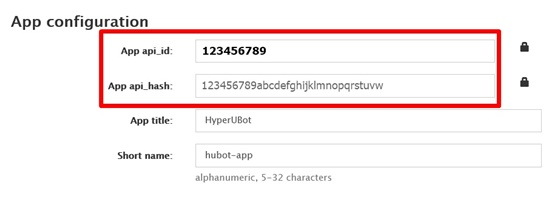

# HyperUBot Guide - Set up in Arch Linux or a Arch Linux Based Distro
## 0. Pre-requisites

Before starting up, make sure you have the following packages installed:

- Python
- Git
- Neofetch
- FFmpeg
- FLAC
- Nano editor

It is required to have at least Python 3.8. To install the following packages, open your Terminal and run the following command:

`sudo pacman -Sy python3 python-pip git neofetch ffmpeg flac nano`

This guide is written specifically to an installation of Arch Linux, however it can be also applicable to Arch Based Distros (such as Manjaro).

## 1. Download HyperUBot

After having the needed packages installed, you will need to download and extract the bot's package from the GitHub release section.
You can do such with the following commands:

1. `curl -H "Accept: application/json" https://api.github.com/repos/nunopenim/HyperUBot/releases/latest | grep '"tarball_url"' | cut -d '"' -f4 | wget --output-document=HyperUBot.tar.gz -i -`
2. `mkdir HyperUBot` (create a new directory named `HyperUBot`)
3. `tar -xvf HyperUBot.tar.gz --directory HyperUBot --strip-components=1` (extract downloaded package to `HyperUBot` directory)
4. `rm HyperUBot.tar.gz` (delete downloaded package; optional)

If the download and extract went fine you should have a folder named `HyperUBot` in the current working directory with all it's contents in it.

Change the directory to `HyperUBot` by using the following command:

`cd HyperUBot`

## 2. Setup HyperUBot

You can set up HyperUBot using it's own Setup Assistant (recommended) or doing it manually by creating the required configuration file and an optional configuration file using Nano editor and installing the pip requirements.

### 2.1 HyperUBot's Setup Assistant (recommended for beginners)

The Setup Assistant guides you through all required processes to run HyperUBot properly on your Arch Linux System such as creating the configuration file and installing the pip requirements automatically.
Run the following command to start the Setup Assistant:

`python3 setup.py`

**Jump to Step [3. Running the bot!](#3-running-the-bot) if Setup Assistant was completed successfully**

### 2.2 Setup HyperUBot manually (for advanced users)

To set up HyperUBot manually you need to follow the following steps:

- Installing the required pip packages
- Generating a String Session using generate_session.py script
- Create your secured configuration file
- Creating an optional configuration file (config.env or config.py)

### 2.2.1 Installing the pip packages

In HyperUBot's main directory, run the following command:

`python3 -m pip install -r requirements.txt`

This should install all the bot's requirements. After this command is done, and if it ran well, you are ready to advance to #2.2.2.

### 2.2.2 Get your API Key and API Hash

These 2 values mentioned in the title above are required in order to run an userbot at all. To get the `API Key` and `API Hash` values, you will need to login to [My Telegram](https://my.telegram.org/).


Here you can create an App, in the API Development Tools page.
After creating an App, your will need the `App api_id` value, and the `App api_hash` for generating a `String session` and for your
secure configuration.



IMPORTANT: **Don't share these values with anyone!**

### 2.2.3 Generate a String session

We have included, in the root folder of the userbot, a python script to generate a `String session` by using the values you got before.
This is required in order to run HyperUBot properly. To do such, you can run the command:

`python3 generate_session.py`

It will ask you for your phone number the login code message and probably for your accounts password.

> This all sounds very... yeah suspicious but we guarantee you that we are not collecting any data. The only purpose of this is to allow HyperUBot to login into your acoount. If you still think this all is suspicious, you're free to review the whole source code (which is why we made it publicly viewable)

After you generated your `String session`, you may got a long string, keep it safe, you will need it for the next step.

### 2.2.4 Create your secure configuration

As you probably thought already this step will create a secured configuration of your `App api_id`, `App api_hash` and your previously
generated `String session` to keep them safe from unauthorized access. To finally create your secure config, run the following command:

`python3 update_secure_cfg.py`

It will ask you for your `API Key`, `API Hash` and your `String session`. Optionally you can also setup a password to additionally protect your secure config, however HyperUBot will ask you each time for the password at start if you setting up one.

> If you forgot your password, you will have to create a new secure config!

### 2.2.5 Create an optional configuration file (yes this step is optional)

The bot can additionally load a config file, either `.env` or `.py`. You can find the sample configs inside `userbot` directory of HyperUBot. Sample configs are **NOT** to be used and just serves as demonstration files, with descriptions of the supported fields.
Some modules downloaded from community repos might require you to add extra configuration fields or classes for them to properly work!

### 2.2.5-1 Setup config using ENV

To create a new config `.env` file, run the following command:

`nano userbot/config.env`

This will open the nano text editor, inside you can copy the following template:

```
# Optional configs
UBOT_LANG = "en"
LOGGING = False
LOGGING_CHATID = 0
TEMP_DL_DIR = "./downloads"
NOT_LOAD_MODULES = []
COMMUNITY_REPOS = []
```

### 2.2.5-2 Setup config using py script

To create a new config `.py` file, run the following command:

`nano userbot/config.py`

This will open the nano text editor, inside you can copy the following template:

```python
class ConfigClass(object):
    # Optional configs
    UBOT_LANG = "en"
    LOGGING = False
    LOGGING_CHATID = 0
    TEMP_DL_DIR = "./downloads"
    NOT_LOAD_MODULES = []
    COMMUNITY_REPOS = []
```

Save it, by doing **CTRL + S** and then **CTRL + X**, to exit the editor.

> Note: Only one config file, either `config.env` or `config.py`, should be configured in `userbot` directory.
If both are configured there, then only `config.env` will be loaded.

### 2.2.5.1 Logging, Language and Community Repos (optional)

Setting up logging is easy, all you need is a designated log group **(Do not use public groups, or you could be banned for spam!)**.
Having the log group, you need to find it's ID. You can do such by using a Group Manager Bot,
or if your userbot is working already, by the .chatinfo command.
Copy this ID and put it in the `LOGGING_CHATID` field e.g `LOGGING_CHATID = -100123456789`,
then set `LOGGING` config to `True`. That's it!

To set up a language, you will need to change the `UBOT_LANG` config,
to any of the supported languages inside `translations` directory.
Just replace `en` by any other language code (no need to include the .py part of the file).

Community repos are also easy to set up. All you need is the name of the repository and the author,
in GitHub. Then add it, between "", to between the [] in the `COMMUNITY_REPOS` field.
If you need to add more repositories, separate them by commas (for example ["nunopenim/repo1", "nunopenim/repo2"]).

## 3. Running the bot!

If your configuration is valid, and everything has been set-up correctly, you are ready to start!
Do such by running the following command:

`python3 -m userbot`

If you see this message below in terminal

`I: userbot: You're running HyperUBot vX.X.X as [your Telegram name] (ID: 123456789)`

then congratulations! You successfully did setup HyperUBot on your Arch Linux System!


Enjoy HyperUBot and have fun!
